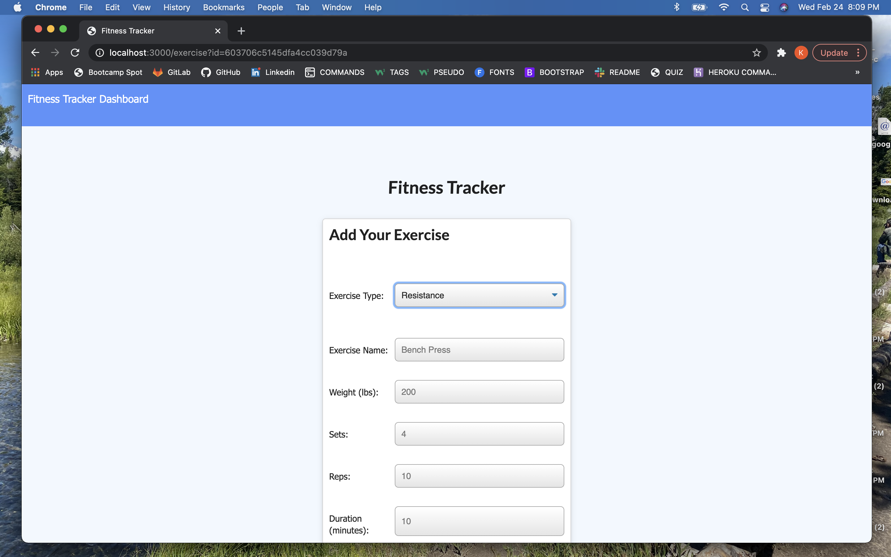
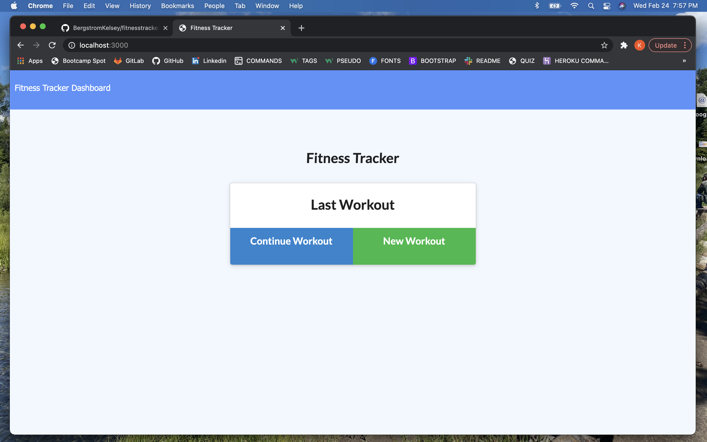
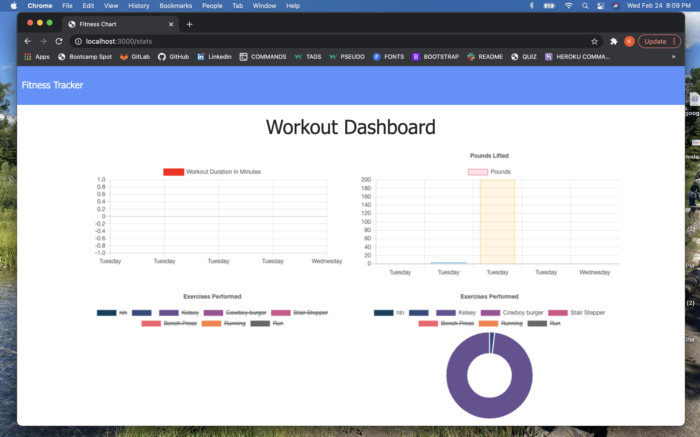

# fitnesstracker

This application was made for anyone who loves fitness and excerise! The Fitness Tracker provides a way for the user to track, view, save and update their workouts. Workouts can be saved in great detail, such as type of excersise, weight amount, number of repitions and even duration time. It also displays all workout totals via charts so that the user can really see their improvements, where they may be lacking and what areas they need to make adjustments.

To use this application, simply enter in a new workout or update current workout and hit add exercise!

-REPOSITORY: https://github.com/BergstromKelsey/fitnesstracker

-DEPLOYED: https://kelseysfitnesstracker.herokuapp.com/

